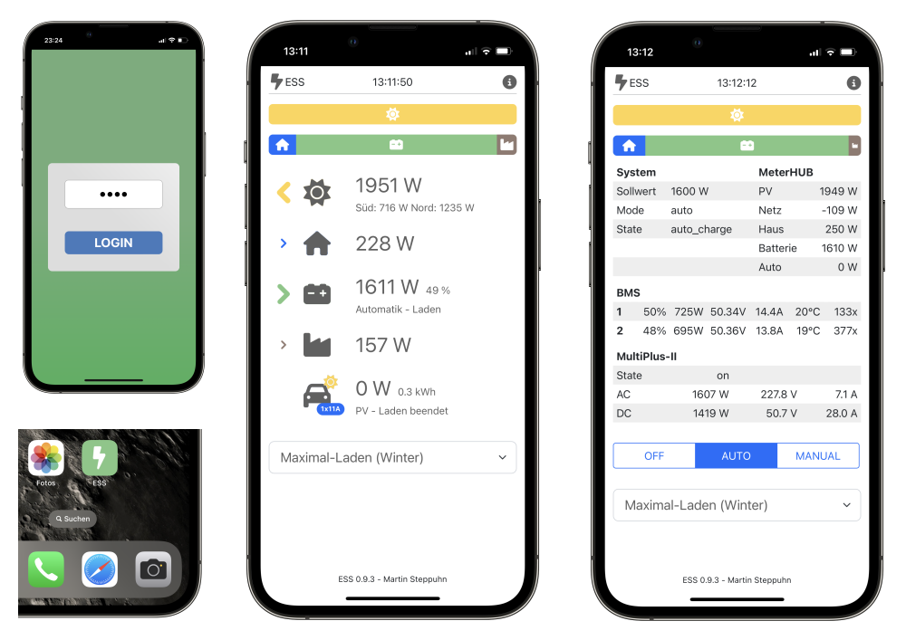
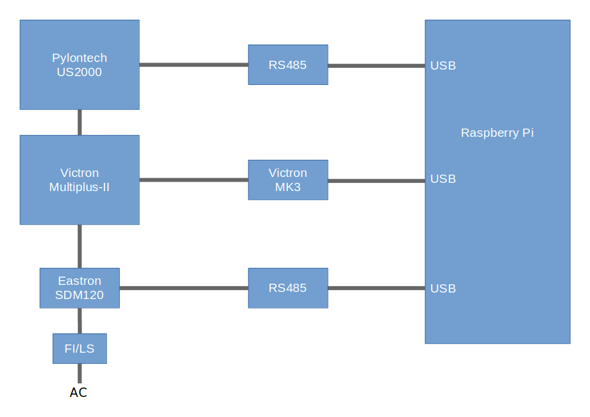
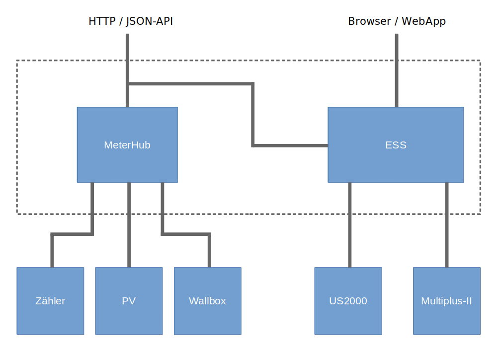
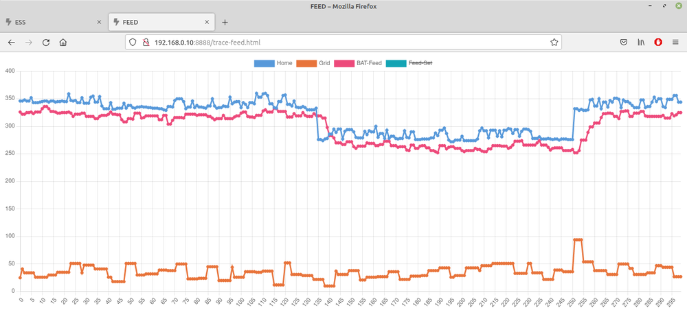
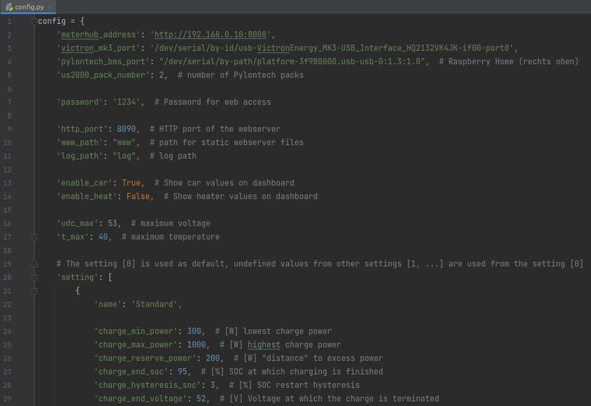

# ESS

Die ESS Software kann einen Victron Multiplus-II im netzparallelen Betrieb direkt ansteuern (**ohne** Venus GX, **ohne** Venus OS).
Die PV Erzeugung und der Verbrauch des Gebäudes wird kontinuierlich erfasst. Bei Überschuss wird der Akku geladen. 
Die im Akku gespeicherte Energie wird über Nulleinspeisung abgegeben (Der Inverter erzeugt genau soviel Energie wie benötigt wird)

Features:
* Automatische Lade-/Entladesteuerung
* Nulleinspeisungsregelung
* Integrierter Webserver mit Web-App
* Multiplus-II Sleepmode (1,3Watt)
* Integration des Pylontech US2000 BMS 
* Konfiguration eigener Profile 
* API (HTTP/JSON)
* Benötigt lediglich Python und USB-Ports (Raspberry, Synology NAS, ...)

Die reine Ansteuerung des Multiplus 2 im ESS Mode 3, ohne Weboberfläche etc. ist hier zu finden: https://github.com/martiby/multiplus2

## Webserver / Web-App

## Hardware

* Victron Multiplus-II 
* Victron MK3-USB-Interface
* Pylontech US2000
* Stromzähler: Eastron SDM630 
* 2x Waveshare USB TO RS485 

## Software

## Live-Ansicht der Regelung

Die Regelung (Zykluszeit 750ms) wird mit den einzelnen Messungen visualisiert. 

## Konfiguartion

Über die Datei `config.py` können Einstellungen vorgenommen werden. Es könne individuelle Profile erstellt werden, die
über den Webserver einfach umgeschaltet werden können. 

## Installation

**Python**
 
    pip3 install -r requirements.txt

**Service einrichten**  

    sudo cp ess.service /etc/systemd/system

**Service verwenden** 

    sudo systemctl start ess
    sudo systemctl stop ess
    sudo systemctl restart ess
    sudo systemctl enable ess
    sudo systemctl disable ess

**Logging abfragen**

    sudo journalctl -u ess
    sudo journalctl -u ess -f